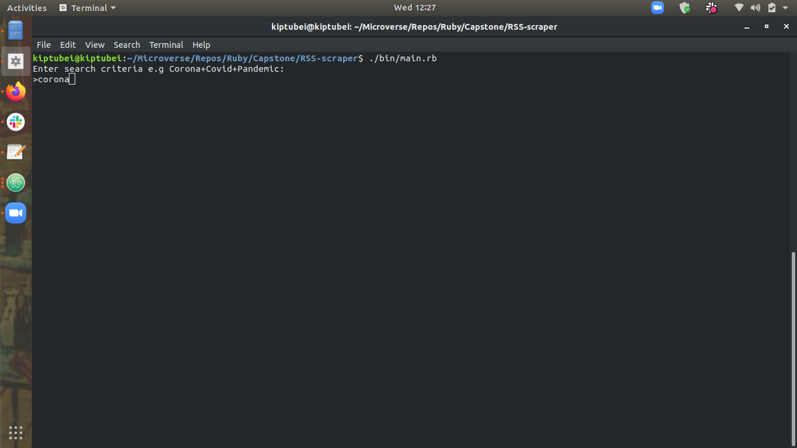
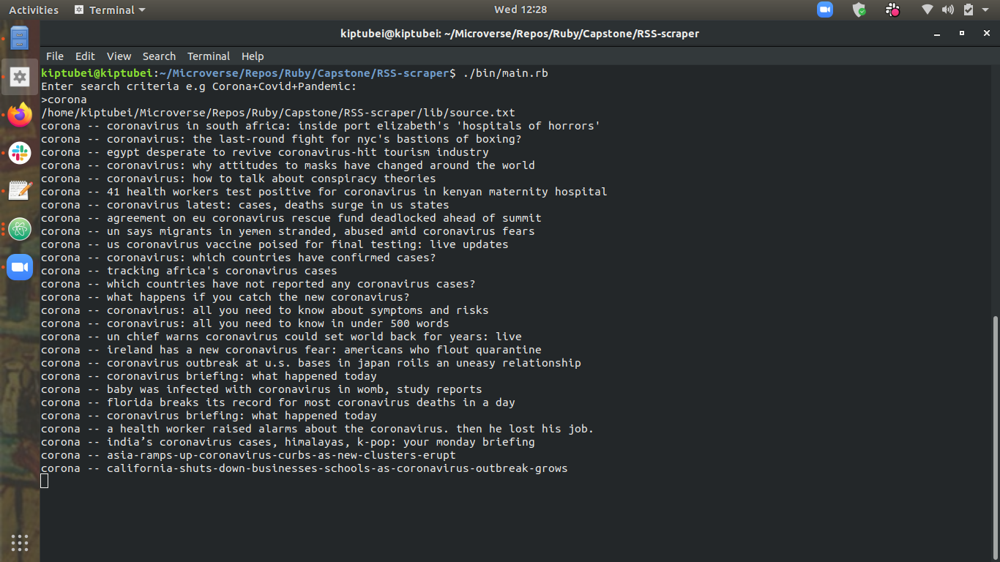
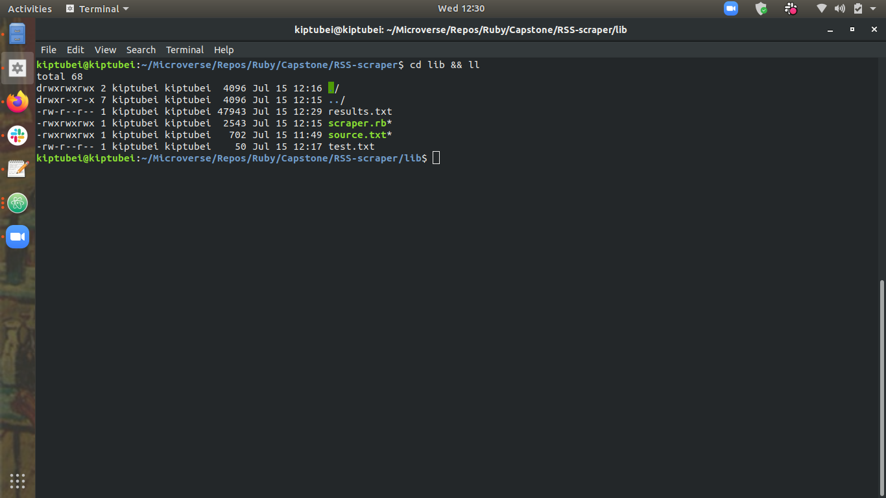
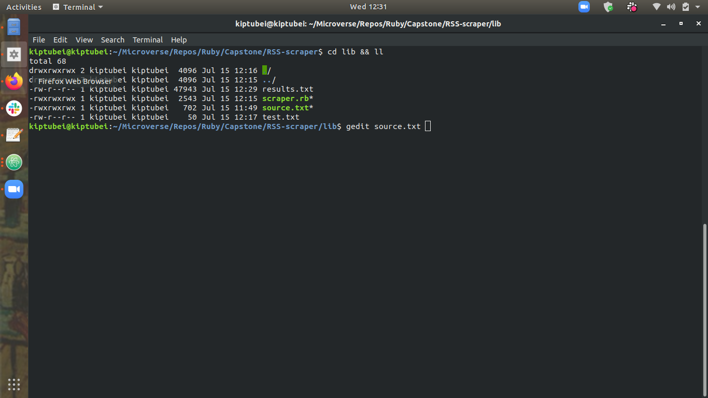
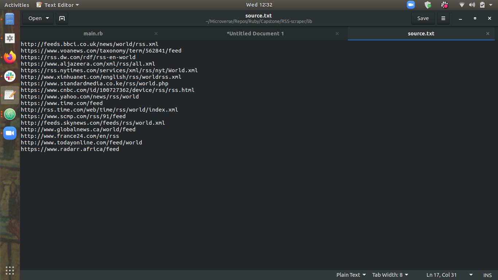

# RSS-scraper

Web scraper that gets articles of your choice from multiple news feeds .Just specify which topics
you are interested in and voila! No need to spend hours surfing the web looking through infinite websites.

## About

The rss-scraper is a dynamic and powerful web scraper that allows you to search for stories based
on select keywords of your choice .It can scrape data simultaneously from multiple news web sites (currently 17) as long as they have an RSS feed (which most major outlets have)

RSS (real simple syndication) is a standard hence most rss sites conform to a set tags convention.
This RSS scraper takes advantage of this feature and is intentionally very configurable,hence this scraper can be expanded exponentially to include multiple and more relevant sources as you wish.
Output is also stored in an easy to access text file in lib/result.txt

## Instructions 🔧

From your command line, first clone the project:

```bash
# Clone this repository
$ git clone https://github.com/kiptubei/RSS-scraper.git

# Go into the folder RSS-scraper where the game is present
$ cd RSS-scraper

# install dependencies
$ bundle install

# Navigate to bin folder
$ cd bin

# In command prompt, run the following command
$ ./main.rb
```

Follow the prompts and enjoy the results .
(make sure dependencies are installed as described above)








Adding and rss feed is also very easy

```bash
   # Navigate to lib folder
   $ cd lib

   # Edit source.txt
   $ cd gedit source.txt
```





## Tools and technology used

- Ruby 2.7.x
- [Rspec](https://rspec.info/)
- [nokogiri](https://nokogiri.org/)
- [httparty](https://github.com/jnunemaker/httparty)

## 🔨 Testing the Logic

To run the tests described for each method:

- change directory to the root of the project (cd into the project folder)
- from terminal run the command `rspec`
- to run a specific test `rspec ./spec/scraper_spec.rb:8` (here 104 is the line number of the method)

## Contributors

​👤 **Mark James Kiptubei**

- [Github](https://github.com/kiptubei)
- [Linkedin](https://www.linkedin.com/in/mark-james-k-aa875829/)

# Github link:

For the: [Github-link](https://github.com/kiptubei/RSS-scraper/)

## Live Demo

## Show your support

Give a ⭐️ if you like this project!

## Acknowledgments

- Thanks to Microverse and httparty and nokogiri
